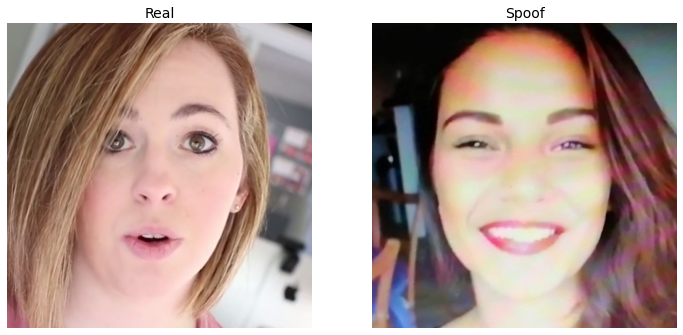

# Facial-antispoofing

Вам предстоит определить к какому классу принадлежат изображения лиц: оригинальные кадры (real) или кадры, полученные при съемке экранов различными мобильными устройствами (spoof).

Базы Train и Test - это кадры из видеозаписей, снятых в различных условиях. Оригинальные видеозаписи получены с помощью веб-камер, камер мобильных телефонов или скачаны c Youtube. Атаки повторного воспроизведения получены путем съемки экранов различных ноутбуков и мониторов камерами мобильных телефонов в момент проигрывания оригинальных видеозаписей различных людей. Атаки были получены как в лабораторных условиях, так и с помощью исполнителей, зарегистрированных в краудсорсинговых интернет-сервисах Яндекс.Толока и Amazon Mechanical Turk.

# Result

| Metric                   | Validation (20%)    |
|--------------------------|---------------------|
| logloss                  | 0.15620794892311096 |
| balanced_sparse_accuracy | 0.01923076994717121 |
| true_real                | 227.0               |
| false_real               | 29.0                |
| true_spoof               | 1386.0              |
| false_spoof              | 18.0                |
| accuracy                 | 0.9716689586639404  |
| precision                | 0.88671875          |
| recall                   | 0.9265305995941162  |
| auc                      | 0.9901218414306641  |

